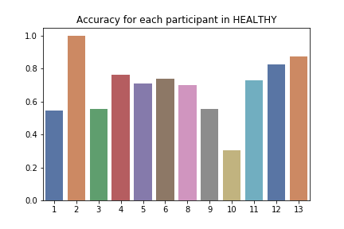
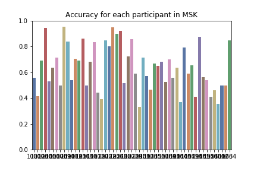
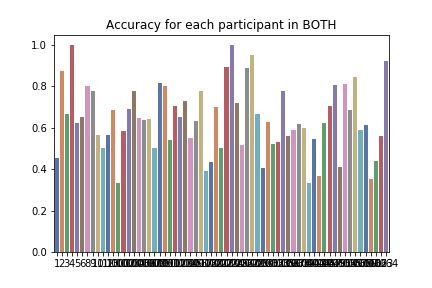

# Neurips 2020 Paper Sumbission for June 03

## First analysis with small resolution (step_size = 10 and 78 participants)
Goal here is to do a first round of the analysis to fine tune our pipeline and start generating results

### Healthy only (n = 12)
```
Accuracies: 
Participant 1: accuracy = 0.5454545454545454
Baseline = 12
Pain = 10
Ratio Baseline/Pain = 1.2
------
Participant 2: accuracy = 1.0
Baseline = 6
Pain = 2
Ratio Baseline/Pain = 3.0
------
Participant 3: accuracy = 0.5555555555555556
Baseline = 8
Pain = 10
Ratio Baseline/Pain = 0.8
------
Participant 4: accuracy = 0.7619047619047619
Baseline = 10
Pain = 11
Ratio Baseline/Pain = 0.9090909090909091
------
Participant 5: accuracy = 0.7083333333333334
Baseline = 13
Pain = 11
Ratio Baseline/Pain = 1.1818181818181819
------
Participant 6: accuracy = 0.7391304347826086
Baseline = 12
Pain = 11
Ratio Baseline/Pain = 1.0909090909090908
------
Participant 8: accuracy = 0.7
Baseline = 11
Pain = 9
Ratio Baseline/Pain = 1.2222222222222223
------
Participant 9: accuracy = 0.5555555555555556
Baseline = 7
Pain = 11
Ratio Baseline/Pain = 0.6363636363636364
------
Participant 10: accuracy = 0.30434782608695654
Baseline = 13
Pain = 10
Ratio Baseline/Pain = 1.3
------
Participant 11: accuracy = 0.7272727272727273
Baseline = 11
Pain = 11
Ratio Baseline/Pain = 1.0
------
Participant 12: accuracy = 0.8260869565217391
Baseline = 12
Pain = 11
Ratio Baseline/Pain = 1.0909090909090908
------
Participant 13: accuracy = 0.875
Baseline = 6
Pain = 10
Ratio Baseline/Pain = 0.6
------
Mean accuracy: 0.6915534747056488
```



Some participant are highly unbalanced in their window repartition.

### MSK only (n = 53)
```
Accuracies: 
Participant 1001: accuracy = 0.5555555555555556
Baseline = 3
Pain = 6
Ratio Baseline/Pain = 0.5
------
Participant 1002: accuracy = 0.4166666666666667
Baseline = 7
Pain = 5
Ratio Baseline/Pain = 1.4
------
Participant 1003: accuracy = 0.6923076923076923
Baseline = 4
Pain = 9
Ratio Baseline/Pain = 0.4444444444444444
------
Participant 1004: accuracy = 0.9444444444444444
Baseline = 9
Pain = 9
Ratio Baseline/Pain = 1.0
------
Participant 1005: accuracy = 0.5294117647058824
Baseline = 9
Pain = 8
Ratio Baseline/Pain = 1.125
------
Participant 1006: accuracy = 0.6363636363636364
Baseline = 3
Pain = 8
Ratio Baseline/Pain = 0.375
------
Participant 1007: accuracy = 0.7142857142857143
Baseline = 7
Pain = 7
Ratio Baseline/Pain = 1.0
------
Participant 1008: accuracy = 0.5
Baseline = 9
Pain = 11
Ratio Baseline/Pain = 0.8181818181818182
------
Participant 1009: accuracy = 0.9545454545454546
Baseline = 11
Pain = 11
Ratio Baseline/Pain = 1.0
------
Participant 1010: accuracy = 0.84
Baseline = 14
Pain = 11
Ratio Baseline/Pain = 1.2727272727272727
------
Participant 1011: accuracy = 0.5384615384615384
Baseline = 5
Pain = 8
Ratio Baseline/Pain = 0.625
------
Participant 1012: accuracy = 0.7058823529411765
Baseline = 10
Pain = 7
Ratio Baseline/Pain = 1.4285714285714286
------
Participant 1013: accuracy = 0.6923076923076923
Baseline = 15
Pain = 11
Ratio Baseline/Pain = 1.3636363636363635
------
Participant 1014: accuracy = 0.8636363636363636
Baseline = 11
Pain = 11
Ratio Baseline/Pain = 1.0
------
Participant 1015: accuracy = 0.5
Baseline = 11
Pain = 9
Ratio Baseline/Pain = 1.2222222222222223
------
Participant 1016: accuracy = 0.6842105263157895
Baseline = 8
Pain = 11
Ratio Baseline/Pain = 0.7272727272727273
------
Participant 1017: accuracy = 0.8333333333333334
Baseline = 9
Pain = 9
Ratio Baseline/Pain = 1.0
------
Participant 1018: accuracy = 0.4444444444444444
Baseline = 7
Pain = 11
Ratio Baseline/Pain = 0.6363636363636364
------
Participant 1020: accuracy = 0.391304347826087
Baseline = 13
Pain = 10
Ratio Baseline/Pain = 1.3
------
Participant 1021: accuracy = 0.85
Baseline = 10
Pain = 10
Ratio Baseline/Pain = 1.0
------
Participant 1022: accuracy = 0.8
Baseline = 11
Pain = 9
Ratio Baseline/Pain = 1.2222222222222223
------
Participant 1023: accuracy = 0.9473684210526315
Baseline = 9
Pain = 10
Ratio Baseline/Pain = 0.9
------
Participant 1024: accuracy = 0.9
Baseline = 10
Pain = 10
Ratio Baseline/Pain = 1.0
------
Participant 1025: accuracy = 0.92
Baseline = 14
Pain = 11
Ratio Baseline/Pain = 1.2727272727272727
------
Participant 1026: accuracy = 0.5172413793103449
Baseline = 17
Pain = 12
Ratio Baseline/Pain = 1.4166666666666667
------
Participant 1027: accuracy = 0.7222222222222222
Baseline = 9
Pain = 9
Ratio Baseline/Pain = 1.0
------
Participant 1028: accuracy = 0.8571428571428571
Baseline = 10
Pain = 11
Ratio Baseline/Pain = 0.9090909090909091
------
Participant 1029: accuracy = 0.5897435897435898
Baseline = 28
Pain = 11
Ratio Baseline/Pain = 2.5454545454545454
------
Participant 1030: accuracy = 0.3333333333333333
Baseline = 44
Pain = 10
Ratio Baseline/Pain = 4.4
------
Participant 1031: accuracy = 0.7142857142857143
Baseline = 26
Pain = 9
Ratio Baseline/Pain = 2.888888888888889
------
Participant 1032: accuracy = 0.5714285714285714
Baseline = 11
Pain = 10
Ratio Baseline/Pain = 1.1
------
Participant 1033: accuracy = 0.4666666666666667
Baseline = 5
Pain = 10
Ratio Baseline/Pain = 0.5
------
Participant 1035: accuracy = 0.6666666666666666
Baseline = 9
Pain = 9
Ratio Baseline/Pain = 1.0
------
Participant 1036: accuracy = 0.6511627906976745
Baseline = 32
Pain = 11
Ratio Baseline/Pain = 2.909090909090909
------
Participant 1037: accuracy = 0.6818181818181818
Baseline = 11
Pain = 11
Ratio Baseline/Pain = 1.0
------
Participant 1038: accuracy = 0.5238095238095238
Baseline = 10
Pain = 11
Ratio Baseline/Pain = 0.9090909090909091
------
Participant 1039: accuracy = 0.7
Baseline = 9
Pain = 11
Ratio Baseline/Pain = 0.8181818181818182
------
Participant 1041: accuracy = 0.5555555555555556
Baseline = 2
Pain = 7
Ratio Baseline/Pain = 0.2857142857142857
------
Participant 1043: accuracy = 0.6363636363636364
Baseline = 11
Pain = 11
Ratio Baseline/Pain = 1.0
------
Participant 1044: accuracy = 0.36666666666666664
Baseline = 19
Pain = 11
Ratio Baseline/Pain = 1.7272727272727273
------
Participant 1045: accuracy = 0.7916666666666666
Baseline = 13
Pain = 11
Ratio Baseline/Pain = 1.1818181818181819
------
Participant 1047: accuracy = 0.5882352941176471
Baseline = 7
Pain = 10
Ratio Baseline/Pain = 0.7
------
Participant 1049: accuracy = 0.6538461538461539
Baseline = 15
Pain = 11
Ratio Baseline/Pain = 1.3636363636363635
------
Participant 1051: accuracy = 0.4117647058823529
Baseline = 6
Pain = 11
Ratio Baseline/Pain = 0.5454545454545454
------
Participant 1054: accuracy = 0.875
Baseline = 12
Pain = 4
Ratio Baseline/Pain = 3.0
------
Participant 1055: accuracy = 0.5625
Baseline = 12
Pain = 4
Ratio Baseline/Pain = 3.0
------
Participant 1057: accuracy = 0.5384615384615384
Baseline = 2
Pain = 11
Ratio Baseline/Pain = 0.18181818181818182
------
Participant 1058: accuracy = 0.4117647058823529
Baseline = 6
Pain = 11
Ratio Baseline/Pain = 0.5454545454545454
------
Participant 1060: accuracy = 0.46153846153846156
Baseline = 3
Pain = 10
Ratio Baseline/Pain = 0.3
------
Participant 1061: accuracy = 0.35294117647058826
Baseline = 6
Pain = 11
Ratio Baseline/Pain = 0.5454545454545454
------
Participant 1062: accuracy = 0.5
Baseline = 5
Pain = 11
Ratio Baseline/Pain = 0.45454545454545453
------
Participant 1063: accuracy = 0.5
Baseline = 5
Pain = 11
Ratio Baseline/Pain = 0.45454545454545453
------
Participant 1064: accuracy = 0.8461538461538461
Baseline = 5
Pain = 8
Ratio Baseline/Pain = 0.625
------
Mean accuracy: 0.6396699972438663
```



### BOTH Healthy and MSK (n=65)
```
Accuracies: 
Participant 1: accuracy = 0.45454545454545453
Baseline = 12
Pain = 10
Ratio Baseline/Pain = 1.2
------
Participant 2: accuracy = 0.875
Baseline = 6
Pain = 2
Ratio Baseline/Pain = 3.0
------
Participant 3: accuracy = 0.6666666666666666
Baseline = 8
Pain = 10
Ratio Baseline/Pain = 0.8
------
Participant 4: accuracy = 1.0
Baseline = 10
Pain = 11
Ratio Baseline/Pain = 0.9090909090909091
------
Participant 5: accuracy = 0.625
Baseline = 13
Pain = 11
Ratio Baseline/Pain = 1.1818181818181819
------
Participant 6: accuracy = 0.6521739130434783
Baseline = 12
Pain = 11
Ratio Baseline/Pain = 1.0909090909090908
------
Participant 8: accuracy = 0.8
Baseline = 11
Pain = 9
Ratio Baseline/Pain = 1.2222222222222223
------
Participant 9: accuracy = 0.7777777777777778
Baseline = 7
Pain = 11
Ratio Baseline/Pain = 0.6363636363636364
------
Participant 10: accuracy = 0.5652173913043478
Baseline = 13
Pain = 10
Ratio Baseline/Pain = 1.3
------
Participant 11: accuracy = 0.5
Baseline = 11
Pain = 11
Ratio Baseline/Pain = 1.0
------
Participant 12: accuracy = 0.5652173913043478
Baseline = 12
Pain = 11
Ratio Baseline/Pain = 1.0909090909090908
------
Participant 13: accuracy = 0.6875
Baseline = 6
Pain = 10
Ratio Baseline/Pain = 0.6
------
Participant 1001: accuracy = 0.3333333333333333
Baseline = 3
Pain = 6
Ratio Baseline/Pain = 0.5
------
Participant 1002: accuracy = 0.5833333333333334
Baseline = 7
Pain = 5
Ratio Baseline/Pain = 1.4
------
Participant 1003: accuracy = 0.6923076923076923
Baseline = 4
Pain = 9
Ratio Baseline/Pain = 0.4444444444444444
------
Participant 1004: accuracy = 0.7777777777777778
Baseline = 9
Pain = 9
Ratio Baseline/Pain = 1.0
------
Participant 1005: accuracy = 0.6470588235294118
Baseline = 9
Pain = 8
Ratio Baseline/Pain = 1.125
------
Participant 1006: accuracy = 0.6363636363636364
Baseline = 3
Pain = 8
Ratio Baseline/Pain = 0.375
------
Participant 1007: accuracy = 0.6428571428571429
Baseline = 7
Pain = 7
Ratio Baseline/Pain = 1.0
------
Participant 1008: accuracy = 0.5
Baseline = 9
Pain = 11
Ratio Baseline/Pain = 0.8181818181818182
------
Participant 1009: accuracy = 0.8181818181818182
Baseline = 11
Pain = 11
Ratio Baseline/Pain = 1.0
------
Participant 1010: accuracy = 0.8
Baseline = 14
Pain = 11
Ratio Baseline/Pain = 1.2727272727272727
------
Participant 1011: accuracy = 0.5384615384615384
Baseline = 5
Pain = 8
Ratio Baseline/Pain = 0.625
------
Participant 1012: accuracy = 0.7058823529411765
Baseline = 10
Pain = 7
Ratio Baseline/Pain = 1.4285714285714286
------
Participant 1013: accuracy = 0.6538461538461539
Baseline = 15
Pain = 11
Ratio Baseline/Pain = 1.3636363636363635
------
Participant 1014: accuracy = 0.7272727272727273
Baseline = 11
Pain = 11
Ratio Baseline/Pain = 1.0
------
Participant 1015: accuracy = 0.55
Baseline = 11
Pain = 9
Ratio Baseline/Pain = 1.2222222222222223
------
Participant 1016: accuracy = 0.631578947368421
Baseline = 8
Pain = 11
Ratio Baseline/Pain = 0.7272727272727273
------
Participant 1017: accuracy = 0.7777777777777778
Baseline = 9
Pain = 9
Ratio Baseline/Pain = 1.0
------
Participant 1018: accuracy = 0.3888888888888889
Baseline = 7
Pain = 11
Ratio Baseline/Pain = 0.6363636363636364
------
Participant 1020: accuracy = 0.43478260869565216
Baseline = 13
Pain = 10
Ratio Baseline/Pain = 1.3
------
Participant 1021: accuracy = 0.7
Baseline = 10
Pain = 10
Ratio Baseline/Pain = 1.0
------
Participant 1022: accuracy = 0.5
Baseline = 11
Pain = 9
Ratio Baseline/Pain = 1.2222222222222223
------
Participant 1023: accuracy = 0.8947368421052632
Baseline = 9
Pain = 10
Ratio Baseline/Pain = 0.9
------
Participant 1024: accuracy = 1.0
Baseline = 10
Pain = 10
Ratio Baseline/Pain = 1.0
------
Participant 1025: accuracy = 0.72
Baseline = 14
Pain = 11
Ratio Baseline/Pain = 1.2727272727272727
------
Participant 1026: accuracy = 0.5172413793103449
Baseline = 17
Pain = 12
Ratio Baseline/Pain = 1.4166666666666667
------
Participant 1027: accuracy = 0.8888888888888888
Baseline = 9
Pain = 9
Ratio Baseline/Pain = 1.0
------
Participant 1028: accuracy = 0.9523809523809523
Baseline = 10
Pain = 11
Ratio Baseline/Pain = 0.9090909090909091
------
Participant 1029: accuracy = 0.6666666666666666
Baseline = 28
Pain = 11
Ratio Baseline/Pain = 2.5454545454545454
------
Participant 1030: accuracy = 0.4074074074074074
Baseline = 44
Pain = 10
Ratio Baseline/Pain = 4.4
------
Participant 1031: accuracy = 0.6285714285714286
Baseline = 26
Pain = 9
Ratio Baseline/Pain = 2.888888888888889
------
Participant 1032: accuracy = 0.5238095238095238
Baseline = 11
Pain = 10
Ratio Baseline/Pain = 1.1
------
Participant 1033: accuracy = 0.5333333333333333
Baseline = 5
Pain = 10
Ratio Baseline/Pain = 0.5
------
Participant 1035: accuracy = 0.7777777777777778
Baseline = 9
Pain = 9
Ratio Baseline/Pain = 1.0
------
Participant 1036: accuracy = 0.5581395348837209
Baseline = 32
Pain = 11
Ratio Baseline/Pain = 2.909090909090909
------
Participant 1037: accuracy = 0.5909090909090909
Baseline = 11
Pain = 11
Ratio Baseline/Pain = 1.0
------
Participant 1038: accuracy = 0.6190476190476191
Baseline = 10
Pain = 11
Ratio Baseline/Pain = 0.9090909090909091
------
Participant 1039: accuracy = 0.6
Baseline = 9
Pain = 11
Ratio Baseline/Pain = 0.8181818181818182
------
Participant 1041: accuracy = 0.3333333333333333
Baseline = 2
Pain = 7
Ratio Baseline/Pain = 0.2857142857142857
------
Participant 1043: accuracy = 0.5454545454545454
Baseline = 11
Pain = 11
Ratio Baseline/Pain = 1.0
------
Participant 1044: accuracy = 0.36666666666666664
Baseline = 19
Pain = 11
Ratio Baseline/Pain = 1.7272727272727273
------
Participant 1045: accuracy = 0.625
Baseline = 13
Pain = 11
Ratio Baseline/Pain = 1.1818181818181819
------
Participant 1047: accuracy = 0.7058823529411765
Baseline = 7
Pain = 10
Ratio Baseline/Pain = 0.7
------
Participant 1049: accuracy = 0.8076923076923077
Baseline = 15
Pain = 11
Ratio Baseline/Pain = 1.3636363636363635
------
Participant 1051: accuracy = 0.4117647058823529
Baseline = 6
Pain = 11
Ratio Baseline/Pain = 0.5454545454545454
------
Participant 1054: accuracy = 0.8125
Baseline = 12
Pain = 4
Ratio Baseline/Pain = 3.0
------
Participant 1055: accuracy = 0.6875
Baseline = 12
Pain = 4
Ratio Baseline/Pain = 3.0
------
Participant 1057: accuracy = 0.8461538461538461
Baseline = 2
Pain = 11
Ratio Baseline/Pain = 0.18181818181818182
------
Participant 1058: accuracy = 0.5882352941176471
Baseline = 6
Pain = 11
Ratio Baseline/Pain = 0.5454545454545454
------
Participant 1060: accuracy = 0.6153846153846154
Baseline = 3
Pain = 10
Ratio Baseline/Pain = 0.3
------
Participant 1061: accuracy = 0.35294117647058826
Baseline = 6
Pain = 11
Ratio Baseline/Pain = 0.5454545454545454
------
Participant 1062: accuracy = 0.4375
Baseline = 5
Pain = 11
Ratio Baseline/Pain = 0.45454545454545453
------
Participant 1063: accuracy = 0.5625
Baseline = 5
Pain = 11
Ratio Baseline/Pain = 0.45454545454545453
------
Participant 1064: accuracy = 0.9230769230769231
Baseline = 5
Pain = 8
Ratio Baseline/Pain = 0.625
------
Mean accuracy: 0.6416815286129934
```

